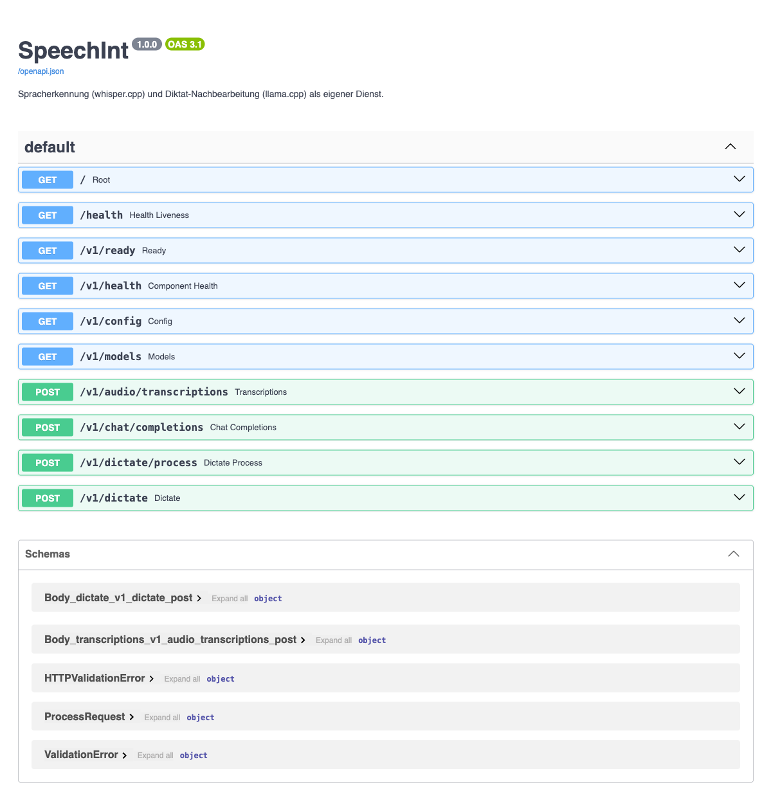

# SpeechInt

Spracherkennung und Diktat-Nachbearbeitung als eigener Dienst.

SpeechInt kapselt die rechenintensiven Teile der Diktatfunktion von LLMInt –
**whisper.cpp** (Spracherkennung, Modell `small`) und **llama.cpp** mit
**Qwen3.5-2B Q4** (Nachbearbeitung des Transkripts) – hinter einer kleinen
HTTP-API. Damit lassen sich diese Komponenten auf einen separaten Docker-Host
auslagern, während LLMInt selbst schlank bleibt und nur noch HTTP-Aufrufe macht.

```
┌────────────┐   HTTP    ┌──────────────────────────────────────────┐
│  LLMInt    │ ────────► │  SpeechInt (eigener Docker-Host)         │
│  Diktat-UI │  /v1/*    │                                          │
└────────────┘           │  gateway ──► whisper.cpp   (small)       │
                         │     │        llama.cpp     (Qwen3.5-2B Q4)│
                         │     └── /v1/ready: sind die Modelle da?  │
                         └──────────────────────────────────────────┘
```

## Mindestanforderungen

Ein Speech-Endpunkt ist dimensioniert für:

| Ressource | Minimum | Anmerkung |
|---|---|---|
| CPU | **6 Kerne** | x86-64 **mit AVX2** (oder ARM mit NEON) |
| RAM | **16 GB** | inkl. Platz für den ersten Modelldownload |
| Disk | ~3 GB | GGML-Modell (~470 MB) + GGUF (~1,5 GB) + Images |

Das ist die **Dimensionierungsgrundlage** für dieses Projekt: die Thread-Vorgaben
beider Modellserver (`6`) entsprechen diesen sechs Kernen, die Speichergrenzen in
`docker-compose.yml` sind auf dieses Budget zugeschnitten, und der Gateway prüft
die Werte beim Start.

Ein Endpunkt unterhalb dieser Werte läuft weiter, ist aber langsamer. Der Gateway
bricht nichts ab, sondern protokolliert die Abweichung beim Start und meldet sie
über `GET /v1/config` im Feld `host`:

```json
"host": {
  "cores": 6,
  "memory_gb": 16.0,
  "container_memory_gb": 0.5,
  "avx2": true,
  "architecture": "x86_64",
  "minimum": { "cores": 6, "memory_gb": 16.0, "avx2": true },
  "budget_gb": { "gateway": 0.3, "whisper": 1.2, "llm": 3.0 },
  "meets_minimum": true,
  "warnings": []
}
```

`memory_gb` ist der Arbeitsspeicher der Maschine, auf der die Modelle laufen –
nicht die Speichergrenze des Gateway-Containers (die steht daneben in
`container_memory_gb` und ist absichtlich klein). Auf ARM-Hardware entfällt die
AVX2-Prüfung (`"avx2": null`) – dort rechnet NEON, und
`docker-compose.arm64.yml` baut whisper.cpp nativ.

### Speicherbudget

Auf der Referenzmaschine bleibt der gesamte Stack deutlich unter 16 GB:

| Container | Bedarf | Grenze (`mem_limit`) | Zweck |
|---|---:|---:|---|
| `gateway` | ~0,3 GB | 512 MB | FastAPI, hält keine Modelle |
| `whisper` | ~1,2 GB | 2 GB | `ggml-small.bin` + Inferenzpuffer |
| `llm` | ~3,0 GB | 5 GB | Q4_K_M-Gewichte + KV-Cache |
| **Summe** | **~4,5 GB** | 7,5 GB | Rest bleibt für OS, Page-Cache, Downloads |

Die Grenzen sind über `.env` anpassbar (`WHISPER_MEM_LIMIT`, `LLM_MEM_LIMIT`,
`SPEECHINT_MEM_LIMIT`). Wer ein größeres Modell einsetzt, muss sie mit anheben.

### Leistung auf der Referenzmaschine

Richtwerte für 6 Kerne / AVX2, CPU-only, ein Vorgang gleichzeitig:

| Vorgang | Modell | Richtwert |
|---|---|---|
| Transkription | whisper `small`, 6 Threads | ~2–4× Echtzeit, d. h. ein 10-s-Segment in ~3–5 s |
| Diktat-Nachbearbeitung | Qwen3.5-2B Q4, 6 Threads, 4096 Kontext | ~1–2 s pro Fragment |

Diktat ist damit flüssig nutzbar: LLMInt schickt kurze Segmente und zeigt das
Ergebnis, während der Sprecher weiterredet.

## Schnellstart

```bash
cp .env.example .env
# Token setzen, damit die API nicht offen im Netz steht:
sed -i '' "s/^SPEECHINT_TOKEN=.*/SPEECHINT_TOKEN=$(openssl rand -hex 32)/" .env

docker compose up -d
docker compose logs -f gateway
```

Der **erste** Start lädt die Modelle herunter (whisper ~470 MB, GGUF ~1,5 GB) und
dauert entsprechend. Solange antwortet die API mit `503` und `Retry-After` –
siehe [Ladefortschritt](#ladefortschritt).

Auf Apple Silicon oder anderen ARM-Hosts:

```bash
docker compose -f docker-compose.yml -f docker-compose.arm64.yml up -d
```

## API

Nur der `gateway` veröffentlicht einen Port; `whisper` und `llm` bleiben im
internen Netz. Alle `/v1/*`-Routen außer `/v1/ready` verlangen den Token als
`X-Auth-Token: <token>` oder `Authorization: Bearer <token>`.

| Methode | Pfad | Zweck |
|---|---|---|
| `GET` | `/health` | Liveness des Gateway-Prozesses (ohne Token) |
| `GET` | `/v1/ready` | **Bereitschaft** beider Modelle, 200/503 (ohne Token) |
| `GET` | `/v1/health` | Zustand je Komponente, 200/503 |
| `GET` | `/v1/config` | Fähigkeiten, Vorgaben, Grenzen, Host-Dimensionierung |
| `GET` | `/v1/models` | verfügbare Modelle |
| `POST` | `/v1/audio/transcriptions` | Audiodatei → Rohtranskript |
| `POST` | `/v1/chat/completions` | OpenAI-kompatibler Durchgriff auf llama.cpp |
| `POST` | `/v1/dictate/process` | Transkriptfragment → fertiger Text |
| `POST` | `/v1/dictate` | Audiodatei → fertiger Text (in einem Aufruf) |

Die interaktive Beschreibung liegt unter `http://<host>:<port>/docs`:



Beispiele:

```bash
TOKEN=$(grep '^SPEECHINT_TOKEN=' .env | cut -d= -f2)

# Transkription
curl -sS -X POST http://speech:8080/v1/audio/transcriptions \
  -H "X-Auth-Token: $TOKEN" \
  -F file=@segment.wav -F language=de
# {"text":"Hallo Welt","model":"small","duration_ms":3120,...}

# Fertiger Diktattext in einem Aufruf
curl -sS -X POST http://speech:8080/v1/dictate \
  -H "X-Auth-Token: $TOKEN" \
  -F file=@segment.wav \
  -F 'commands=[{"phrase":"punkt","type":"insert","value":"."}]'
```

## Ladefortschritt

Der erste Start ist lang und unbeaufsichtigt: whisper.cpp liest sein GGML-Modell,
llama.cpp lädt ~1,5 GB GGUF von Hugging Face. Ein Client, der nur „Connection
refused“ sieht, kann das nicht von einer kaputten Installation unterscheiden.
Deshalb macht SpeechInt die Startphase zu einem expliziten Zustand.

`GET /v1/ready` und `GET /v1/health` liefern **denselben** Body, aber `200` erst,
wenn beide Modelle nutzbar sind, sonst `503` mit `Retry-After`:

```json
{
  "ok": false,
  "status": "loading",
  "ready": false,
  "message": "Noch nicht bereit – die Modelle werden geladen oder heruntergeladen. Spracherkennung (Whisper): bereit; Diktat-Modell (Qwen): startet. Bitte in 15 s erneut versuchen.",
  "retry_after": 15,
  "components": {
    "whisper": { "state": "ready", "state_label": "bereit", "ok": true, "http": 200, "model": "small" },
    "llm": { "state": "starting", "state_label": "startet", "ok": false, "http": 0, "model": "Qwen3.5-2B Q4" }
  }
}
```

Zustände je Komponente:

| Zustand | Bedeutung | Antwort |
|---|---|---|
| `ready` | Modell geladen, Anfragen möglich | 200 |
| `loading` | Server antwortet und meldet „Loading model“ | 503 + `Retry-After` |
| `starting` | noch nie erreichbar, Port zu – Modell wird geholt | 503 + `Retry-After` |
| `unreachable` | war schon erreichbar (oder Gnadenfrist abgelaufen), jetzt nicht | normaler Fehlerpfad |
| `error` | erreichbar, aber unerwarteter Status | normaler Fehlerpfad |
| `unconfigured` | keine URL konfiguriert | normaler Fehlerpfad |

Der aggregierte `status` ist `ready`, `loading` (nur vorübergehende Zustände),
`degraded` (teils bereit) oder `unavailable`.

Nur die vorübergehenden Zustände `loading` und `starting` führen zu `503`; ein
wirklich defekter Modellserver läuft weiter durch die normalen Fehlerpfade, damit
der regelbasierte Diktat-Fallback in LLMInt funktioniert.

### Vertrag für Clients

Anfragen an `/v1/audio/transcriptions`, `/v1/dictate/process`, `/v1/dictate` und
`/v1/chat/completions` antworten während der Ladephase mit `503`:

```json
{
  "ok": false,
  "error": "service_loading",
  "component": "llm",
  "message": "Diktat-Modell (Qwen) startet noch oder lädt das Modell herunter.",
  "retry_after": 15
}
```

Empfohlenes Verhalten eines Clients:

1. Vor dem ersten Diktat einmal `GET /v1/ready` pollen (kein Token nötig).
2. Bei `503` die `message` anzeigen und nach `retry_after` Sekunden erneut fragen.
3. Bei `503` mit `error: "service_loading"` **nicht** auf einen eigenen Fallback
   ausweichen – das Modell kommt ja noch.
4. Bei `unreachable`/`error` wie gewohnt auf den regelbasierten Fallback gehen.

Die Gnadenfrist, ab der ein nie erreichbarer Dienst als `unreachable` statt
`starting` gilt, ist `SPEECHINT_STARTING_GRACE_SECONDS` (Standard 900 s) – lang
genug für den ersten Download auf einer langsamen Leitung.

## Konfiguration

Alle Werte stehen in `.env` (siehe `.env.example`). Die wichtigsten:

| Variable | Standard | Bedeutung |
|---|---|---|
| `SPEECHINT_PORT` | `8080` | veröffentlichter Port, hierauf zeigt LLMInt |
| `SPEECHINT_TOKEN` | leer | Shared Secret; leer = keine Authentifizierung |
| `SPEECHINT_MAX_AUDIO_MB` | `25` | Obergrenze eines Audiosegments |
| `WHISPER_MODEL` | `small` | GGML-Modell (`tiny`…`large-v3`) |
| `WHISPER_THREADS` | `6` | Threads der Spracherkennung |
| `LLM_GGUF_FILE` | `Qwen3.5-2B-Q4_K_M.gguf` | Modell des Diktats |
| `LLM_THREADS` | `6` | Threads der Nachbearbeitung |
| `LLM_CTX_SIZE` | `4096` | Kontextfenster, von allen Slots gemeinsam genutzt |
| `LLM_PARALLEL` | `1` | gleichzeitige Diktat-Slots (1 serialisiert Anfragen) |

GPU-Beschleunigung: `WHISPER_IMAGE_TAG` bzw. `LLM_IMAGE_TAG` auf `main-cuda`,
`server-cuda`, `server-vulkan` oder `server-rocm` setzen und die Container mit
GPU-Zugriff starten. Die Speichergrenzen bleiben dabei unverändert.

## Aufbau

```
docker-compose.yml          gateway + whisper + llm
docker-compose.arm64.yml    Override für ARM-Hosts
Dockerfile.whisper          nativer whisper.cpp-Build für arm64
gateway/                    FastAPI-Anwendung (die einzige veröffentlichte API)
  app/main.py               Routen und Fehlerbehandlung
  app/health.py             Bereitschafts- und Ladezustände
  app/host.py               Dimensionierung und Mindestanforderungen
  app/whisper.py            Client für whisper.cpp
  app/llm.py                Client für llama.cpp
  app/pipeline.py           Diktat-Pipeline inkl. Fallback
  app/dictation.py          Prompt-Aufbau, Kommandos, Textbereinigung
  tests/                    pytest-Suite
```

Tests:

```bash
python3 -m venv .venv && .venv/bin/pip install -r gateway/requirements.txt pytest
cd gateway && ../.venv/bin/python -m pytest
```

## Zusammenspiel mit LLMInt

LLMInt bleibt die Oberfläche: Kommandotabelle, Prompt und Modell-ID werden bei
jedem Aufruf mitgeschickt (`POST /v1/dictate/process`). Der Dienst ist dadurch
zustandslos, und Administratoren konfigurieren weiterhin alles im LLMInt-
Adminbereich – dort werden die Speech-Endpunkte samt Token hinterlegt.
